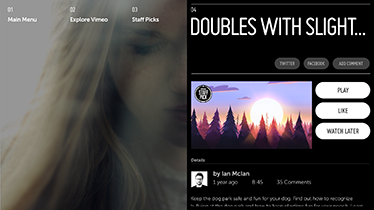
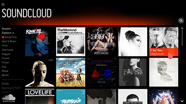
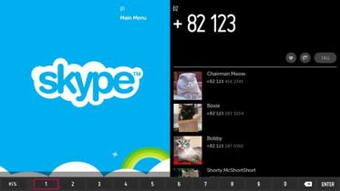
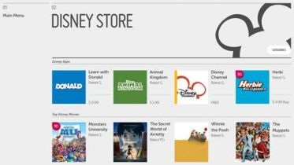
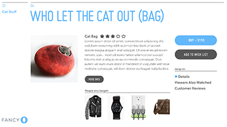
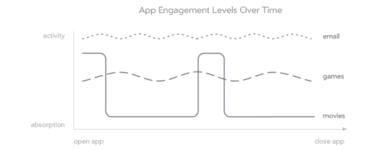

% The Big Picture

Welcome to the growing community of designers working with Moonstone and webOS.
Before you dive into the details of your design, it is important to have a clear
understanding of the end users, their expectations of TV, and how the remote
control allows them to interact with the TV.  How are the users' experiences,
expectations, and interactions different on the TV than in the mobile and
desktop environments?  Our research into these questions led to the formulation
of the webOS Design Principles; these principles, in turn, have informed the
design of the webOS System UI, Enyo/Moonstone Framework, and Design Pattern
Language, creating a foundation for successful application development on TV.
Read the following sections to gain a better understanding of the big picture.

## Application Types

Is your goal to provide a highly immersive full screen video experience, an
interactive social or communication experience, a well curated one-click
shopping experience, or an intricate production tool?  The following categories
and examples will help you to identify the type of application you are designing
and determine whether it is appropriate for TV.

### Content

Video, music, and photo applications are the most appropriate apps for TV.  They
take advantage of the large-screen shared device in a way that users are
familiar with and have come to expect.

Examples of content consumption apps include Live TV, Netflix, Pandora, and
Instagram.

### Social Communication

Social communication applications have become a new favorite on the TV,
providing a large-screen experience for connecting with friends and family, and
redefining how users interact with their TVs.

Examples of social communication apps include Skype, Google Hangouts, Twitter,
Facebook, instant messaging, and VoIP calling.

### Shopping

Shopping applications on TV are an excellent opportunity for e-commerce, but the
activity can easily become too cumbersome to be enyoyable.  Take advantage of
the full screen by displaying large and beautiful product images; make
purchasing or downloading a simple, one-click experience.  Avoid complicated
shopping options.

Examples of shopping apps include the App Catalog, Amazon, Fancy, PayPal, and
food ordering.

### Productivity

Productivity applications are usually the least appropriate for the TV.  They
are inherently Lean Forward experiences requiring complex interactions that are
incompatible with both the input method (i.e., the remote control) and the
user's expectations of a TV-based experience.

Examples of productivity apps are email clients, Microsoft Excel, and Adobe
Photoshop.

## Engagement Styles

The user's engagement style is defined by the level of absorption vs. the level
of activity.

In a high-absorption experience, the user is either passive or thoughtful over a
long period of time.  Engagement with long-form media such as movies and novels
is typically associated with the highest levels of absorption.

By contrast, in a high-activity experience, the user switches tasks frequently,
exhibiting a relatively low level of sustained attention.  Web browsing and
checking email are commonly characterized by a high level of activity.

It is also possible for a single experience to have relatively high levels of
both activity and absorption (e.g., when playing a game).

The setting, conditions, and environment that users are accustomed to for a
particular engagement style can influence their expectations of, and levels of
comfort with, specific devices and application experiences.  For example, users
may reject the idea of engaging in high-activity experiences (such as checking
email) while sitting in front of the TV in their living room--if they associate
that environment with high-absorption engagement.

The level of user engagement with an application may also change over time.  The
image above identifies a movie application as being high-absorption and
low-activity.  However, when first opening a movie application, the user may
want or need to find a new movie to watch.  During this time, the level of
activity is high and the level of absorption is low.  Once the user finds a
movie to watch, these levels switch.  The user quickly becomes absorbed, and the
level of activity remains low until the movie is over.
