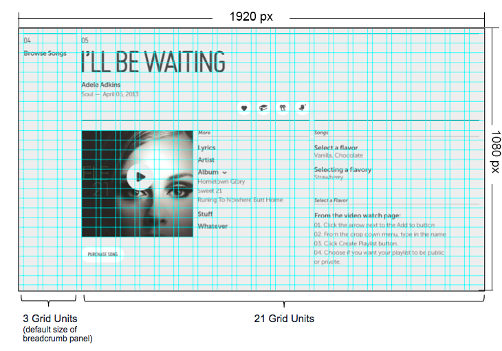

% Layout Grid

## What Is the Grid?

The layout grid provides consistent layout units in which panel width may be
expressed.  The layout grid gives developers and designers a common point of
reference when designing application screens.

## How Do I Use the Grid?

Use Grid Units to measure the width of the panel.  Use Gutter space between
panels or objects.

Each Grid Unit is 60 pixels wide by 40 pixels high.  Each Gutter Unit is 20
pixels wide by 40 pixels high.

Note: There is a 20px safe area around the edges of the screen.  Do not place UI
controls within this 20px safe area.
