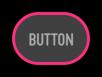
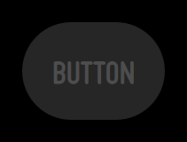
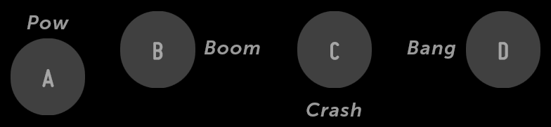

% Buttons

## Behavior

In Moonstone, a button will always be in one of four states:

1. **Normal** (up)

      

2. **Pressed** (down)

      
        
3. **Focused** (hover)

      

4. **Disabled** (dimmed)

      

When using a 5-way or Pointer remote, focusing and then pressing a button will
result in the execution of the corresponding action (upon release of the
button).

Note that the focused state may be animated.

## moon.Button

[moon.Button](../../../index.html#/kind/moon.Button) derives directly from
[enyo.Button](../../../index.html#/kind/enyo.Button) and provides the same basic
functionality, along with a dose of Moonstone visual styling.

When a `moon.Button` is tapped, it generates an `ontap` event; you may respond
to the event by specifying a handler method, e.g.:

```javascript
    {kind: "moon.Button", content: "tap me", ontap: "buttonTapped"},

    ...

    buttonTapped: function(inSender, inEvent) {
        // respond to the tap event
    }
```

You may apply a caption to a button by wrapping it inside a
[moon.CaptionDecorator](../../../index.html#/kind/moon.CaptionDecorator):

```javascript
    components: [
        {name: 'scroller', kind: 'moon.Scroller', fit: true, touch: true, components: [
            {classes: "moon-button-sample-wrapper", components: [
                {kind: "moon.CaptionDecorator", side: "top", content: "Pow", components: [
                    {name: "Captioned Button A", kind: "moon.Button",
                        content: "A", ontap: "buttonTapped"}
                ]},
                {kind: "moon.CaptionDecorator", side: "right", content: "Boom", components: [
                    {name: "Captioned Button B", kind: "moon.Button",
                        content: "B", ontap: "buttonTapped"}
                ]},
                {kind: "moon.CaptionDecorator", side: "bottom", content: "Crash", components: [
                    {name: "Captioned Button C", kind: "moon.Button",
                        content: "C", ontap: "buttonTapped"}
                ]},
                {kind: "moon.CaptionDecorator", side: "left", content: "Bang", components: [
                    {name: "Captioned Button D", kind: "moon.Button",
                        content: "D", ontap: "buttonTapped"}
                ]}
            ]}
        ]}
    ]
```



You may create a button with smaller visible dimensions (but a normal-sized tap
target) by setting `small: true` when declaring the button.

## moon.IconButton

[moon.IconButton](../../../index.html#/kind/moon.IconButton), which extends the
[moon.Icon](../../../index.html#/kind/moon.Icon) kind, provides a button with an image
inside.

```javascript
    components: [
        {kind: "moon.IconButton", src: "assets/icon-list.png",
            ontap: "buttonTapped"},
        {kind: "moon.IconButton", src: "assets/icon-list.png",
            ontap: "buttonTapped", disabled: true}
    ]
```


To create a button with an image and accompanying text inside, use a `moon.Icon`
as a component inside a `moon.Button`.
