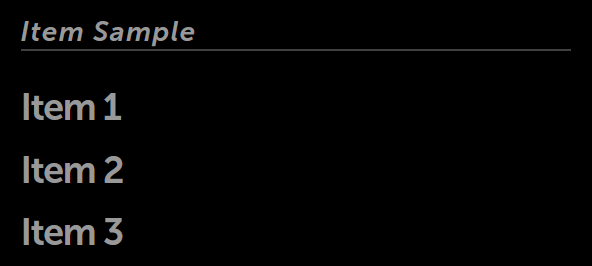

% List Items

Most applications need to display a list of items of one kind or another.
Sometimes the items in the list are very simple, like the name of a contact,
while other times they are complex, like a drawer containing prompts and
buttons.

The Enyo framework and Moonstone library offer a healthy selection of tools for
building lists in your applications.  In this document, we survey the set of
kinds specifically designed for use as list items, along with some others that
are normally used in conjunction with lists. (The kinds for the lists themselves
are covered in the separate documentation for [Lists](../layout/lists.html).)

## List Item Kinds

Each item in a list may contain a text string, an image, or both.  The Moonstone
library offers kinds that implement these basic types of list items, as well as
some with more advanced features.  (Note that these kinds may also be used in
other contexts besides lists; e.g., in menus.)

### moon.Item

[moon.Item](../../../index.html#/kind/moon.Item), the simplest list item kind,
provides an item with a text label specified in its `content` property.

        components: [
            {kind: "moon.Divider", content: "Item Sample"},
            {
                components: [
                    {kind: "moon.Item", content: "Item 1"},
                    {kind: "moon.Item", content: "Item 2"},
                    {kind: "moon.Item", content: "Item 3"}
                ]
            }
        ]

### moon.LabeledTextItem

[moon.LabeledTextItem](../../../index.html#/kind/moon.LabeledTextItem) extends
`moon.Item`, adding the `label` property, which serves as a label accompanying
the content specified in the `text` property.

        components: [
            {kind: 'moon.Scroller', classes: "enyo-fill", components: [
                {
                    kind: "moon.LabeledTextItem",
                    label: "South Park",
                    text: "Follows the misadventures of four irreverent grade schoolers"
                        + " "
                        + "in the quiet, dysfunctional town of South Park, Colorado."
                }
            ]}
        ]

Note that the `label` and `text` fields in this example are not focusable in
Spotlight.

### moon.ImageItem

[moon.ImageItem](../../../index.html#/kind/moon.ImageItem) combines an
[enyo.Image](../../../index.html#/kind/enyo.Image) with a `moon.LabeledTextItem`.
By default, the image is positioned on the left side of the text.

        components: [
            {
                kind: "moon.ImageItem",
                source: "./assets/south_park.png",
                label: "South Park",
                text: "Follows the misadventures of four irreverent grade schoolers"
                    + " "
                    + "in the quiet, dysfunctional town of South Park, Colorado."
            }
        ]

To position the image on the right, set `imageAlignRight: true`.

### moon.SelectableItem

[moon.SelectableItem](../../../index.html#/kind/moon.SelectableItem) features
the `selected` property, which contains a boolean value indicating whether the
item is currently selected.  A selected item will be displayed with a pink dot
to its left.

`moon.SelectableItem` also supports the Enyo Group API by exposing the `active`
property (a boolean indicating whether the item is the currently selected item
within the group) and the `onActivated` event (fired when the item is tapped).
By default, when items are placed in a group, only one may be active at a given
time; if a new item is activated, the previously active item (if there is one)
is de-activated.

        components: [
            {kind: "moon.Divider", content: "Selectable Item Group"},
            {kind: "Group", onActivate: "groupChanged", components: [
                {kind: "moon.SelectableItem", content: "Group Option 1"},
                {kind: "moon.SelectableItem", content: "Group Option 2"},
                {kind: "moon.SelectableItem", disabled: true, content: "Disabled"},
                {kind: "moon.SelectableItem", content: "Group Option 4"},
                {kind: "moon.SelectableItem", content: "Group Option 5", selected: true}
            ]}
        ]

### moon.ExpandableListItem

[moon.ExpandableListItem](../../../index.html#/kind/moon.ExpandableListItem) is
a control with an expanded state and a collapsed state.  It displays a header
while also allowing additional content to be stored in an
[enyo.Drawer](../../../index.html#/kind/enyo.Drawer); when the header is selected,
the drawer opens below.  The drawer is closed by tapping on the header text or
navigating (via 5-way) back to the top of the drawer.

While an ExpandableListItem's child components may be of any kind, by default,
they are instances of `moon.Item`.

In additional to being useful within lists, `moon.ExpandableListItem` serves as
the superkind for a variety of Moonstone pickers.  For more information, see the
documentation on [Pickers](pickers.html).

## Other Kinds Used with Lists

### moon.Divider

[moon.Divider](../../../index.html#/kind/moon.Divider) is a non-actionable
separator control that consists of a horizontal rule and a text label.  The text
label supports marquee behavior for long content.

Dividers are commonly used as category headers (e.g., "A", "B", "C", etc.)
within a list.

        components: [
            {kind: "moon.Divider", content: "Divider 1"}
        ]

### moon.ListActions

[moon.ListActions](../../../index.html#/kind/moon.ListActions) is a menu of
actions that resides on the right side of a list.  When the activator control is
pressed, the menu opens to reveal a set of actions that may be performed on the
items in the list to its left.

The ListActions menu may contain options for sorting (alphabetically, by date,
etc.) or filtering (show only games, show only free items, etc.).  It may also
contain options for editing (deleting or moving) list items.
