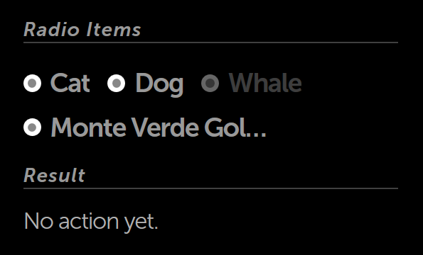

% Radio Items (Radio Buttons)

## moon.RadioItem

[moon.RadioItem](../../api.html#moon.RadioItem) is a
[moon.Button](../../api.html#moon.Button) designed to go inside a
[moon.RadioItemGroup](../../api.html#moon.RadioItemGroup), a
horizontally-oriented group of items in which tapping on one item will release
any previously-tapped items.

Let's look at how a radio item group works.

        enyo.kind({
            name: "moon.sample.RadioItemSample",
            classes: "moon enyo-unselectable enyo-fit",
            kind: "FittableRows",
            components: [
                {fit: true, components: [
                    {kind: "moon.Divider", content: "Radio Items"},
                    {kind: "moon.RadioItemGroup", onActivate: "buttonActivated", components: [
                        {content: "Cat"},
                        {content: "Dog"},
                        {content: "Whale", disabled: true},
                        {content: "Monte Verde Golden Toad"}
                    ]}
                ]},
                {kind: "moon.Divider", content:"Result"},
                {kind: "moon.BodyText", name: "result", content: "No action yet."}
            ],
            rendered: function() {
                this.inherited(arguments);
            },
            buttonActivated: function(inSender, inEvent) {
                var originator = inEvent.originator,
                str = 'The "';
 
                if (!originator || !this.hasNode()) {
                    return;
                }

                str += (inEvent.originator.getActive() && inEvent.originator.kind === "moon.RadioItem")
                    ? originator.getContent() : originator.name;
                str +=  '" item is selected.';

                this.$.result.setContent(str);
            }
        });

Notice that we have one handler method for the entire group.  When an item is
tapped (or "activated"), we are able to identify the source of the event using
`inEvent.originator`.  So if we tap "Dog", we see the following:

Also note that we don't have to explicitly declare the kind for our radio items.
When a new control is added to a `moon.RadioItemGroup`, its kind defaults to
`moon.RadioItem`.  (You can change this behavior by explicitly setting the
`defaultKind` property of the radio group.)
