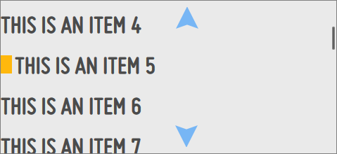

% Scrollers

In a Scroller, the scroll indicator (shown below, at right) only appears while
content is being scrolled.

## enyo.Scroller

[enyo.Scroller](../../api.html#enyo.Scroller) provides a viewport in which the
user may scroll content using touch or mouse actions.  (The scrolling of content
exceeding the size of a viewport is not automatic; for content to scroll, it
must be placed inside a Scroller control.)  `enyo.Scroller` is suitable for use
in both desktop and mobile applications.

The `strategyKind` property determines the type of scrolling used by a given
scroller.  The default value is `"ScrollStrategy"`, which lets the framework
choose an appropriate strategy based on the runtime platform.

While desktop browsers have their own native scrolling mechanisms, some mobile
environments do not have a default scrolling solution for DOM elements.  In such
cases, `enyo.Scroller` implements a scrolling solution based on touch events. 
You may opt into touch-based scrolling either globally (by setting
`enyo.Scroller.touchScrolling` to `true`) or on a per-instance basis (by
specifying a `strategyKind` of `"TouchScrollStrategy"`).  Note that if you opt
in, the scroller will use the touch-based mechanism, even if the app is running
in a desktop browser (in which case, the browser will not display its native
scrollbars, and the user will scroll by clicking and dragging in the content
area).

A third strategy kind, `"TranslateScrollStrategy"`, implements touch scrolling
using translations.  It is currently recommended only for Android 3 and 4.

The `vertical` and `horizontal` properties control scrolling behavior along their
respective axes.  Both properties have the same four possible values:

* `"scroll"` always shows a scrollbar.
* `"auto"` scrolls only if needed (i.e., if content size exceeds viewport size).
* `"hidden"` never scrolls.
* `"default"` (the default value) is the same as `"auto"`.

To programmatically scroll to a specific position with animation, call
`scrollTo(inX, inY)`; to snap to a position without animation, call
`setScrollLeft(inX)` and `setScrollTop(inY)`.

When touch-based scrolling is in effect, the user may drag beyond a valid scroll
position.  When this occurs, the scroller moves with increased tension before
returning to a valid position with an accompanying animation.  To avoid this
behavior, set the `touchOverscroll` property to `false`.

## moon.Scroller

[moon.Scroller](../../api.html#moon.Scroller) inherits from `enyo.Scroller`,
adding support for 5-way focus (Spotlight) and pagination buttons.  It currently
requires a `strategyKind` of `TouchScrollStrategy`.

`moon.Scroller` responds to the `onSpotlightFocused` event by scrolling the event
originator into view. This ensures that 5-way (Spotlight) focused controls are
always in view.

Additionally, `moon.Scroller` will respond to the `onRequestScrollIntoView` event,
which may be fired explicitly/programmatically by controls that should be scrolled
into view.
